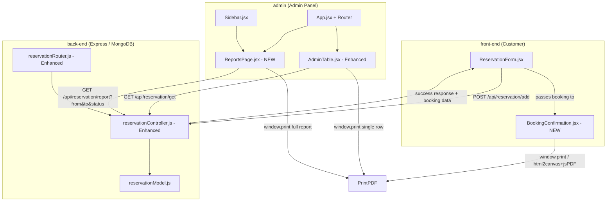
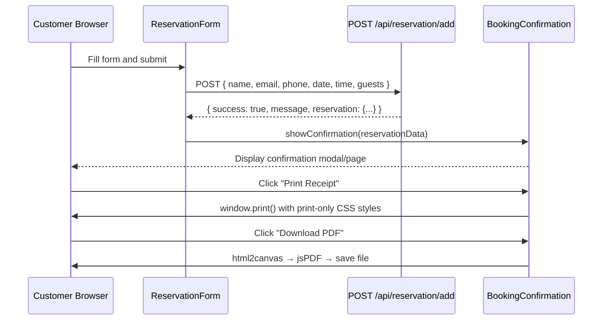
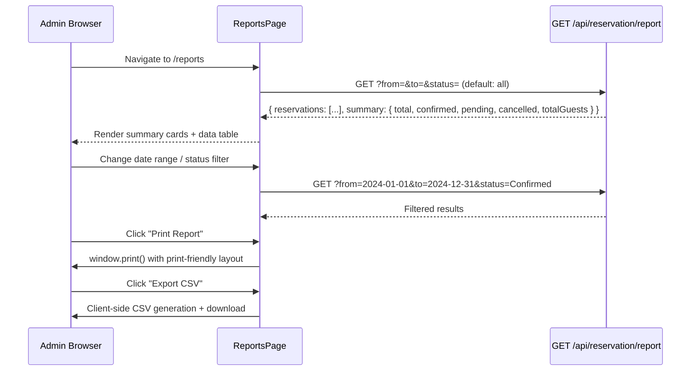
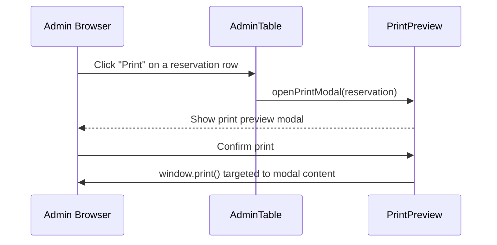

# Design Document: Reservation Report & Print

## Overview

This feature adds two capabilities to the Emerald Bistro system: (1) an Admin Reports page in the admin panel that provides summary analytics and tabular views of reservations filterable by date range and status, with export/print for the full report; and (2) a customer-facing booking confirmation that is shown after a successful reservation submission, allowing the customer to print or save a PDF receipt of their booking details.

Admins can also print or export individual reservation details directly from the Reservations page (AdminTable). The feature is built entirely within the existing React + Vite (admin & front-end) and Node.js/Express/MongoDB stack without introducing new backend services.

---

## Architecture



---

## Sequence Diagrams

### 1. Customer Booking Confirmation & Print



### 2. Admin Reports Page



### 3. Admin Single Reservation Print



---

## Components and Interfaces

### Component 1: `ReportsPage` (admin/src/pages/ReportsPage.jsx) — NEW

**Purpose**: Provides the admin with filtered reports, summary statistics, and export/print controls.

**Interface**:
```typescript
interface ReportsPageProps {
  token: string
}

interface ReportSummary {
  total: number
  confirmed: number
  pending: number
  cancelled: number
  totalGuests: number
}

interface ReportFilters {
  from: string        // ISO date YYYY-MM-DD, empty = no lower bound
  to: string          // ISO date YYYY-MM-DD, empty = no upper bound
  status: 'All' | 'Pending' | 'Confirmed' | 'Cancelled'
}
```

**Responsibilities**:
- Render filter controls (date-from, date-to, status dropdown)
- Fetch `/api/reservation/report` with query params on filter change
- Display summary stat cards (total, confirmed, pending, cancelled, total guests)
- Render filterable table of reservations with status badges
- Provide "Print Report" (window.print) and "Export CSV" (client-side) buttons
- Show empty state when no reservations match filters

---

### Component 2: `BookingConfirmation` (front-end/src/Components/BookingConfirmation.jsx) — NEW

**Purpose**: Shows the customer a confirmation receipt after successful booking, with print and PDF download options.

**Interface**:
```typescript
interface BookingConfirmationProps {
  reservation: ReservationData | null
  onClose: () => void
}

interface ReservationData {
  name: string
  email: string
  phone: string
  date: string
  time: string
  guests: string
  bookingRef?: string   // optional: derived from _id or timestamp
}
```

**Responsibilities**:
- Display as a modal overlay (or full-page) over the reservation form
- Show all booking details in a receipt-style layout with the Emerald Bistro branding
- "Print Receipt" triggers `window.print()` with `@media print` CSS that shows only the receipt
- "Download PDF" uses `html2canvas` + `jsPDF` to capture the receipt div and save as PDF
- "Close" / "Make Another Booking" dismisses the confirmation

---

### Component 3: `AdminTable` (admin/src/pages/AdminTable.jsx) — ENHANCED

**Purpose**: Existing reservations table, enhanced with per-row print capability.

**New Interface Additions**:
```typescript
// Added to existing row actions
function handlePrintSingle(reservation: Reservation): void
// Opens a print-preview modal for one reservation record
```

**New Responsibilities**:
- Add a "Print" icon button to the Action column of each row
- On click, open `<PrintPreviewModal>` populated with that reservation's data
- The modal provides a clean print layout and calls `window.print()` scoped to the modal

---

### Component 4: `PrintPreviewModal` (admin/src/Components/PrintPreviewModal.jsx) — NEW

**Purpose**: Reusable modal that renders a single reservation in a print-ready format for admin use.

**Interface**:
```typescript
interface PrintPreviewModalProps {
  reservation: Reservation | null
  onClose: () => void
}
```

---

## Data Models

### Existing: Reservation (reservationModel.js)

```javascript
// Current schema — no changes required for core feature
{
  _id: ObjectId,        // auto-generated
  name: String,         // required
  email: String,        // required
  phone: String,        // required
  date: String,         // YYYY-MM-DD (stored as string)
  time: String,         // "9:00 AM - 10:00 AM"
  guests: String,       // "1"–"10" (stored as string)
}
```

> **Note on Status**: The current system stores status only in `localStorage` on the admin client. For report filtering by status to work server-side, the `status` field needs to be added to the reservation model. See the Low-Level Design section for the migration path. Alternatively, filtering by status can be done client-side in the initial implementation.

### API Response: Report Endpoint

```typescript
interface ReportResponse {
  reservations: Reservation[]
  summary: {
    total: number
    confirmed: number
    pending: number
    cancelled: number
    totalGuests: number
  }
}
```

---

## Error Handling

### Error Scenario 1: Report API Failure

**Condition**: Network error or server error when fetching `/api/reservation/report`
**Response**: Show a toast error message; render an empty state with a retry button in the reports table
**Recovery**: User clicks retry, which re-fires the API call with the current filters

### Error Scenario 2: PDF Generation Failure

**Condition**: `html2canvas` or `jsPDF` throws an error (e.g., CORS issue with images, insufficient memory)
**Response**: Catch the error, show a toast "PDF generation failed — try printing instead"
**Recovery**: Fallback to `window.print()` is always available as an alternative

### Error Scenario 3: Booking Confirmation Data Missing

**Condition**: The API returns `success: true` but does not return reservation details (e.g., existing backend returns only `{success, message}`)
**Response**: Display confirmation with the data the customer already entered in the form (client state), since the form fields are still in React state at submission time
**Recovery**: No action needed — the client-side data is sufficient for the receipt

### Error Scenario 4: Empty Filter Results

**Condition**: Admin filters by a date range or status that yields zero reservations
**Response**: Show an informative empty state ("No reservations found for the selected filters") — not an error
**Recovery**: Admin clears filters using a "Reset Filters" button

---

## Testing Strategy

### Unit Testing Approach

- Test `buildReportQuery(filters)` utility: verify correct MongoDB query objects are produced for each filter combination (date range only, status only, combined, empty)
- Test `generateCSV(reservations)` utility: verify CSV string output for empty array, single row, and multiple rows with special characters
- Test `computeSummary(reservations, statusMap)` utility: verify counts for each status and total guest sum

### Property-Based Testing Approach

**Property Test Library**: fast-check (compatible with the existing Vite/React setup)

- **For `computeSummary`**: For any array of reservations, `summary.total === reservations.length` always holds; status counts always sum to `total`
- **For `generateCSV`**: For any array of N reservations, the resulting CSV always has exactly N + 1 lines (header + data rows)
- **For `buildReportQuery`**: For any valid filter input, the output query is always a plain object with no prototype pollution

### Integration Testing Approach

- Test the report endpoint end-to-end: seed test reservations into a test DB, call `GET /api/reservation/report` with various query params, assert response shape and counts match expectations
- Test the `addReservation` endpoint with the modified response shape (returns booking data) to verify the confirmation flow

---

## Performance Considerations

- The report page fetches all reservations on mount and applies date/status filtering. For a restaurant with a typical reservation volume (hundreds to low thousands), this is acceptable without pagination.
- CSV export is entirely client-side — no additional server call needed.
- PDF generation with `html2canvas` can be slow for complex layouts. The receipt component should be kept simple (no heavy images in the print area) to keep generation fast.
- If reservation volume grows significantly, the backend `GET /api/reservation/report` endpoint should support pagination parameters (`page`, `limit`).

---

## Security Considerations

- The `/api/reservation/report` endpoint must be protected by the existing `adminAuth` middleware — only admin-authenticated requests should access the full reservation list.
- The `addReservation` endpoint already does not require auth (customers submit without logging in). The response modification (returning booking data) does not expose any additional sensitive data beyond what the customer just submitted.
- Customer-facing print/PDF is performed entirely on the client using the data the customer themselves entered — no new server data is exposed.
- The CSV export is client-side only, available only to logged-in admins.

---

## Dependencies

| Package | Location | Purpose |
|---|---|---|
| `html2canvas` | front-end, admin | Capture DOM to canvas for PDF |
| `jspdf` | front-end, admin | Generate PDF from canvas |
| Existing: `axios` | admin, front-end | API calls (already installed) |
| Existing: `react-icons` | admin | Print/export icon buttons |
| Existing: `react-toastify` | admin, front-end | Error notifications |
| Existing: `tailwindcss` | admin, front-end | Styling |

---

---

# Low-Level Design

## Key Functions with Formal Specifications

### Function 1: `buildReportQuery(filters)`

```typescript
function buildReportQuery(filters: ReportFilters): Record<string, unknown>
```

**Preconditions:**
- `filters` is a non-null object
- `filters.from` and `filters.to` are either empty strings or valid ISO date strings (`YYYY-MM-DD`)
- `filters.status` is one of `'All' | 'Pending' | 'Confirmed' | 'Cancelled'`

**Postconditions:**
- Returns a MongoDB-compatible query object
- If `filters.from` is non-empty, query includes `date: { $gte: filters.from }`
- If `filters.to` is non-empty, query includes `date: { $lte: filters.to }`
- If `filters.status !== 'All'` and status is stored in DB, query includes `status: filters.status`
- If all filters are empty/default, returns `{}`
- No mutation of the input `filters` object

**Loop Invariants:** N/A (no loops)

---

### Function 2: `computeSummary(reservations, statusMap)`

```typescript
function computeSummary(
  reservations: Reservation[],
  statusMap: Record<string, string>
): ReportSummary
```

**Preconditions:**
- `reservations` is a (possibly empty) array of reservation objects
- `statusMap` maps reservation `_id` to status string

**Postconditions:**
- `result.total === reservations.length`
- `result.confirmed + result.pending + result.cancelled === result.total`
- `result.totalGuests === sum of parseInt(r.guests) for each r in reservations`
- Returns a new object; does not mutate inputs

**Loop Invariants:**
- After processing `k` reservations: the running count of each status equals the number of those `k` reservations with that status; the running guest total equals the sum of guests for those `k`

---

### Function 3: `generateCSV(reservations, statusMap)`

```typescript
function generateCSV(
  reservations: Reservation[],
  statusMap: Record<string, string>
): string
```

**Preconditions:**
- `reservations` is a (possibly empty) array
- Each reservation has fields: `name`, `email`, `phone`, `date`, `time`, `guests`, `_id`
- `statusMap` maps `_id` to status

**Postconditions:**
- Returns a UTF-8 string
- First line is always the CSV header: `"#,Name,Email,Phone,Date,Time,Guests,Status"`
- Total lines = `reservations.length + 1`
- Fields containing commas are wrapped in double quotes
- No mutation of inputs

**Loop Invariants:**
- After processing row `k`: the output string contains exactly `k + 1` lines (1 header + k data rows)

---

### Function 4: `handlePrintReport()`

```typescript
function handlePrintReport(): void
```

**Preconditions:**
- The report container DOM element exists and is rendered
- `@media print` CSS rules are defined to hide sidebar and show only the report content

**Postconditions:**
- `window.print()` is invoked exactly once
- No state mutation occurs
- The print dialog is opened by the browser

---

### Function 5: `handleDownloadPDF(elementRef)`

```typescript
async function handleDownloadPDF(elementRef: React.RefObject<HTMLDivElement>): Promise<void>
```

**Preconditions:**
- `elementRef.current` is a mounted, non-null DOM element
- `html2canvas` and `jsPDF` are available

**Postconditions:**
- If successful: a PDF file named `booking-confirmation-[date].pdf` is downloaded
- If `html2canvas` throws: error is caught, toast shown, no file downloaded
- No mutation of React state

**Loop Invariants:** N/A

---

## Algorithmic Pseudocode

### Main Report Fetch and Filter Algorithm

```pascal
ALGORITHM fetchReport(filters)
INPUT: filters of type ReportFilters
OUTPUT: { reservations: Reservation[], summary: ReportSummary }

BEGIN
  ASSERT filters IS NOT NULL
  
  // Build URL query params
  params ← {}
  IF filters.from IS NOT EMPTY THEN
    params.from ← filters.from
  END IF
  IF filters.to IS NOT EMPTY THEN
    params.to ← filters.to
  END IF
  IF filters.status NOT EQUALS 'All' THEN
    params.status ← filters.status
  END IF
  
  // API call
  response ← await axios.get('/api/reservation/report', { params, headers: { token } })
  
  ASSERT response.data.reservations IS ARRAY
  ASSERT response.data.summary IS OBJECT
  
  RETURN response.data
END
```

**Preconditions:**
- `token` is a valid admin JWT in scope
- API server is reachable

**Postconditions:**
- Returns `reservations` array and `summary` object on success
- On network/server error: throws, caller shows toast and renders empty state

---

### computeSummary Algorithm

```pascal
ALGORITHM computeSummary(reservations, statusMap)
INPUT: reservations: Array<Reservation>, statusMap: Record<string, string>
OUTPUT: summary of type ReportSummary

BEGIN
  total     ← reservations.length
  confirmed ← 0
  pending   ← 0
  cancelled ← 0
  guestSum  ← 0
  
  FOR each r IN reservations DO
    // Loop invariant: confirmed + pending + cancelled = index of current r
    // Loop invariant: guestSum = sum of guests for all previously processed reservations
    
    status ← statusMap[r._id] OR 'Pending'
    
    IF status EQUALS 'Confirmed' THEN
      confirmed ← confirmed + 1
    ELSE IF status EQUALS 'Cancelled' THEN
      cancelled ← cancelled + 1
    ELSE
      pending ← pending + 1
    END IF
    
    guestSum ← guestSum + parseInt(r.guests, 10)
  END FOR
  
  ASSERT confirmed + pending + cancelled EQUALS total
  
  RETURN { total, confirmed, pending, cancelled, totalGuests: guestSum }
END
```

---

### generateCSV Algorithm

```pascal
ALGORITHM generateCSV(reservations, statusMap)
INPUT: reservations: Array<Reservation>, statusMap: Record<string, string>
OUTPUT: csvString of type String

BEGIN
  header ← "#,Name,Email,Phone,Date,Time,Guests,Status"
  lines  ← [header]
  
  FOR index ← 0 TO reservations.length - 1 DO
    // Loop invariant: lines.length = index + 1 (header + processed rows)
    r      ← reservations[index]
    status ← statusMap[r._id] OR 'Pending'
    row    ← buildCSVRow(index + 1, r.name, r.email, r.phone, r.date, r.time, r.guests, status)
    lines.push(row)
  END FOR
  
  ASSERT lines.length EQUALS reservations.length + 1
  
  RETURN lines.join('\n')
END

PROCEDURE buildCSVRow(num, name, email, phone, date, time, guests, status)
  // Wrap any field containing comma in double-quotes
  RETURN [num, escape(name), escape(email), escape(phone), date, escape(time), guests, status].join(',')
END PROCEDURE
```

---

### Backend Report Endpoint Algorithm

```pascal
ALGORITHM getReservationReport(req, res)
INPUT: req.query = { from?, to?, status? }
OUTPUT: HTTP JSON response

BEGIN
  query ← {}
  
  IF req.query.from IS NOT EMPTY THEN
    query.date ← query.date OR {}
    query.date.$gte ← req.query.from
  END IF
  
  IF req.query.to IS NOT EMPTY THEN
    query.date ← query.date OR {}
    query.date.$lte ← req.query.to
  END IF
  
  // Status filter: only if status field exists on model
  // Phase 1: client-side status filtering (status stored in localStorage)
  // Phase 2: add status field to model and filter here
  
  reservations ← await reservationModel.find(query).sort({ date: -1 })
  
  summary ← {
    total:      reservations.length,
    totalGuests: sum of parseInt(r.guests) for r in reservations
    // confirmed, pending, cancelled: computed client-side in Phase 1
    //   or server-side in Phase 2 when status is in DB
  }
  
  res.json({ reservations, summary })
END
```

**Preconditions:**
- Request is authenticated via `adminAuth` middleware
- MongoDB connection is active

**Postconditions:**
- Returns `{ reservations, summary }` with HTTP 200 on success
- Returns HTTP 500 with error message on database failure

---

### handleDownloadPDF Algorithm

```pascal
ALGORITHM handleDownloadPDF(elementRef)
INPUT: elementRef — React ref to the receipt DOM element
OUTPUT: Downloaded PDF file (side effect)

BEGIN
  IF elementRef.current IS NULL THEN
    RETURN  // guard: nothing to capture
  END IF
  
  TRY
    canvas  ← await html2canvas(elementRef.current, { scale: 2, useCORS: true })
    imgData ← canvas.toDataURL('image/png')
    
    pdf ← new jsPDF({ orientation: 'portrait', unit: 'mm', format: 'a4' })
    
    pdfWidth  ← pdf.internal.pageSize.getWidth()
    pdfHeight ← (canvas.height * pdfWidth) / canvas.width
    
    pdf.addImage(imgData, 'PNG', 0, 0, pdfWidth, pdfHeight)
    
    filename ← 'booking-confirmation-' + formatDate(new Date()) + '.pdf'
    pdf.save(filename)
    
  CATCH error
    toast.error('PDF generation failed — try printing instead')
    // Do not re-throw; fallback to window.print() is available
  END TRY
END
```

---

## Correctness Properties

1. **Summary consistency**: For any list of reservations and any status map, `computeSummary(reservations, statusMap).confirmed + computeSummary(reservations, statusMap).pending + computeSummary(reservations, statusMap).cancelled === reservations.length`

2. **CSV line count**: For any array of N reservations, `generateCSV(reservations, statusMap).split('\n').length === N + 1`

3. **CSV header immutability**: For any input, the first line of `generateCSV(...)` is always `"#,Name,Email,Phone,Date,Time,Guests,Status"`

4. **Report query monotonicity**: Adding more filters to `buildReportQuery` never produces a query that matches MORE documents than a query with fewer filters

5. **No data mutation**: `computeSummary`, `generateCSV`, and `buildReportQuery` are all pure functions — calling them multiple times with the same inputs always produces the same outputs without modifying input arguments

6. **Authentication enforcement**: Every call to `GET /api/reservation/report` without a valid admin token receives an HTTP 401 response, never a 200 with data
